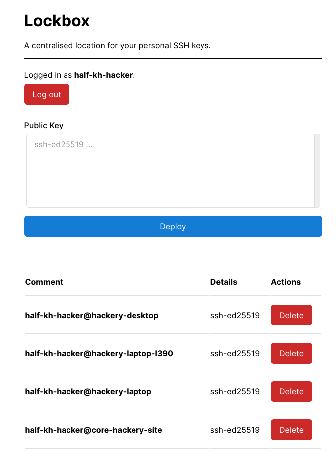

# Lockbox

Aren't you tired of generating so many keys, and having to add them manually to each box and version control forge you want to access?

Lockbox is a centralised store for your personal SSH keys. It supports:

- Any `sshd` through an `AuthorizedKeysCommand` configuration directive
- [GitHub.com](https://github.com/) via OAuth

Written using [Starlette](https://www.starlette.io/).



## Security

**Beware:** For all the systems you hook it up to, Lockbox is a [single point of failure](https://en.wikipedia.org/wiki/Single_point_of_failure).
That is, if an adversary can gain control of your account on the Lockbox instance you are using,
they can deploy their own key and access any of the linked systems.

Furthermore, the administrator of the Lockbox instance you are using is capable of adding keys under any user,
so make sure you trust the admin. (In the best-case scenario, the admin is you. The multi-user functionality
of the software is designed for teams.)

## Details

Without authentication, keys are publicised without comment fields, à la GitHub's `https://github.com/<user>.keys` route.

With authentication, it is possible to access the keys with the comment field intact.

## Connecting using `AuthorizedKeysCommand`

1. Copy `ssh-lockbox/contrib/check_keys.sh` to `/etc/ssh/lockbox_check_keys.sh`.
2. Set up your `sshd_config`:

```
AuthorizedKeysCommand /etc/ssh/lockbox_check_keys.sh "%u"
AuthorizedKeysCommandUser root
```

Each user account you want to be able to be accessible through Lockbox must have a `~/.config/lockbox.conf`, containing two lines:

```
https://my-lockbox.example.com
my-lockbox-username
```

<!-- TODO: A third line contains the access key, which is used to tell the Lockbox server to provide key comment fields. -->

When the key check is complete, the results will cache as a section appended at the end of `.ssh/authorized_keys`:

```
ssh-ed25519 ... me@some-machine.local

### LOCKBOX SECTION ###
# Please do not edit under this sectoin. It is automatically generated,
# and may be wiped at any time.
ssh-ed25519 ...
ssh-ed25519 ...
ssh-ed25519 ...
```

## Connecting a GitHub account

Currently, only GitHub.com is supported. Enterprise instances of GitHub on another domain are not.

First, the administrator of the Lockbox instance must create an OAuth application with GitHub:

You can do this heading to [github.com/settings/developers](https://github.com/settings/developers) and adding a new OAuth app.
I recommend you name it "Lockbox @ &lt;domain&gt;".

The callback URL for the OAuth app should be `https://<lockbox instance>/integrations/github/complete`.

Then, put the client ID and client secret in the corresponding fields in the application's configuration.

Any user can then navigate to `https://<lockbox instance>/integrations/github/initiate` to set up a GitHub integration, after which all of their keys added to Lockbox will be pushed to GitHub, and all future key deployments will also trigger the key being sent to GitHub.

## Running the Server

```
$ # set up a virtualenv, or don't, your choice. then:
$ pip install -r requirements.txt
$ cp .env.schema .env; $EDITOR .env # Set up the DATABASE_URL value
$ alembic upgrade head # Run migrations to initialise the database
$ ./run_prod.sh ./lockbox.sock # Starts a gunicorn instance (with a uvicorn worker) listening at unix:./lockbox.sock
$ # Use nginx to proxy into the socket
```

### Configuration

Configuration can be achieved via a `.env` file or through environment variables.

The configuration entries are as follows:

- `DATABASE_URL`: A connection URL for the application's database. A configuration (using SQLite) for development is included in `.env.schema`.
- `SESSION_SECRET_KEY`: The secret key to sign session information with. This should be a randomly generated blob of data.
- `REGISTRATION_ENABLED`: Whether to permit arbitrary user registration.
- `GITHUB_CLIENT_ID`: An OAuth client ID for GitHub integration.
- `GITHUB_CLIENT_SECRET`: An OAuth client secret for GitHub integration.
